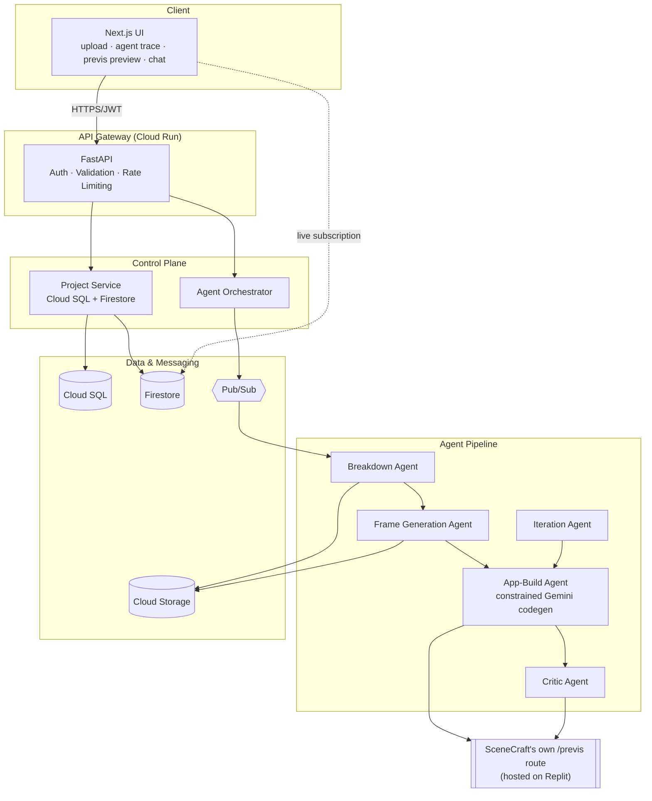

# SceneCraft

[](https://github.com/Monolithic-Dev/Scene-Craft/actions/workflows/ci.yml)
[](LICENSE)

**A script goes in. A working, deployed, clickable previs app comes out — in minutes, not weeks.**

Built for **Agentic Cinema: The Blockbuster Hackathon** (Google Cloud, Replit partner track).

<!-- TODO before submission: replace with a screenshot or GIF of the deployed /previs route -->
<!--  -->

**🔗 Live app:** _[Replit URL — the hackathon partner-track submission link, fill in once deployed]_ · **🎬 Demo video:** _[link — fill in after recording]_ · **📄 Full docs:** [`docs/00-INDEX.md`](docs/00-INDEX.md)

GCP production architecture (Phase 6) is also live, for judges who want to see the full Cloud Run/Cloud SQL/Pub/Sub stack: [`https://scenecraft-staging-web-fq6tp4iyja-uc.a.run.app`](https://scenecraft-staging-web-fq6tp4iyja-uc.a.run.app) — see [`infra/README.md`](infra/README.md).

## How it works

A multi-agent system reads an uploaded script, breaks it into scenes and shots, generates storyboard concept art per shot, and autonomously builds a real interactive previs web app from that data — its own capability, independently verified by a Critic Agent before it's ever shown as done. The result is served from SceneCraft itself and hosted on Replit per the partner track's actual requirement (a build-process + hosting requirement, not a runtime API — see [`docs/Phases/PHASE-04-APP-BUILD-AND-CRITIC.md`](docs/Phases/PHASE-04-APP-BUILD-AND-CRITIC.md) §0 for why that distinction mattered). A director can then click through the result and request changes in plain English — "make scene 4 night-time" — and watch a live agent-trace panel show the rebuild happen.

## Architecture



Full diagram set (state machine, data flow, deployment topology) in [`docs/10-DIAGRAMS.md`](docs/10-DIAGRAMS.md).

## Tech stack

Gemini + Vertex AI (breakdown, image generation, captioning) · FastAPI + Postgres (control plane) · Next.js (frontend + previs app) · MCP (the real agent↔data-layer boundary) · Firestore (live trace push) · OpenTelemetry → Grafana · Redis (distributed rate limiting) · Pub/Sub + Cloud Run (async job dispatch) · Terraform (all infrastructure) · Replit (hosting, partner track requirement).

Full rationale per technology: [`docs/02-TECH-STACK.md`](docs/02-TECH-STACK.md).

## Status

Phases 1-6 complete, including a real deployed staging environment. Phase 7 is in progress. See [`docs/08-IMPLEMENTATION-PLAN.md`](docs/08-IMPLEMENTATION-PLAN.md) for the phase-by-phase plan and [`docs/Phases/`](docs/Phases/) for each phase's detailed spec.

| Phase | Status |
|---|---|
| 1 — Foundations | ✅ Done |
| 2 — Script Breakdown Agent | ✅ Done |
| 3 — Storyboard Frame Generation | ✅ Done |
| 4 — App-Build & Critic Agents | ✅ Done |
| 5 — Iteration Loop & Trace UI | ✅ Done |
| 6 — Observability, Security, Deployment | ✅ Done, staging deployed and live-verified |
| 7 — Demo & Submission | 🔶 In progress — judge guide, demo script, and pitch deck drafted; Replit deployment, demo video recording, and Devpost form submission still open |

Known operational constraint worth flagging: the `GEMINI_API_KEY`'s free tier caps `gemini-2.5-flash` at both 5 requests/minute *and* a 20-requests/day quota — a single day of active development/demo rehearsal can exhaust it (the app handles this correctly, as an honest `failed_needs_review`/`needs_clarification` state, but it's worth having a fallback key or upgraded quota before judging).

## Repository layout

```
apps/
  api/            FastAPI control-plane backend (auth, projects, scripts, jobs)
  web/            Next.js frontend
agents/           Agent orchestrator + per-agent implementations
mcp_server/       Internal MCP server exposing project-state tools to agents
infra/            terraform/ (full IaC), firestore/ (security rules), grafana/ (dashboards)
docs/             PRD, system design, agent architecture, phase-by-phase plan, judge guide
```

See [`docs/07-FOLDER-STRUCTURE.md`](docs/07-FOLDER-STRUCTURE.md) for the rationale behind this layout.

## Architecture note: three independent Python packages

`apps/api`, `mcp_server`, and `agents` each have their own `pyproject.toml` and their own virtualenv — they're separate deployable units (per [`docs/03-SYSTEM-DESIGN.md`](docs/03-SYSTEM-DESIGN.md)), not one monolith. In particular:

- **`agents` never talks to the database.** It calls `mcp_server` over the real MCP protocol (stdio), which in turn calls `apps/api`'s `/internal/v1/*` endpoints over HTTP (guarded by a shared-secret header, enforced again at the infra layer — the agents Cloud Run service account has no Cloud SQL IAM role at all). This is the literal MCP-server boundary the hackathon rubric asks for, not just a design diagram.
- **`apps/api` dispatches agent runs** via a local subprocess in dev, or a Pub/Sub message consumed by a dedicated "Agent Workers" Cloud Run service in production — see `apps/api/src/core/agent_runner.py` and `agents/orchestrator/pubsub_receiver.py`.

---

## Running locally

### Database & Redis

```bash
docker compose up -d postgres redis
```

Brings up a local Postgres (matching Cloud SQL's behavior more closely than the SQLite fallback — SQLite still works out of the box for fast iteration, see `apps/api/.env.example`) and a local Redis for the rate limiter. In staging/prod, Redis is a free external [Upstash](https://upstash.com) instance rather than Cloud Memorystore — see `infra/README.md` for why.

### 1. Backend (control plane)

```bash
cd apps/api
pip install -e ".[dev]"
cp .env.example .env
python -m alembic upgrade head
uvicorn src.main:app --reload
```

API docs: `http://localhost:8000/docs`.

Live agent-trace panel (Phase 5+) additionally needs a GCP project with the Firestore API enabled and a Native-mode database created (`gcloud services enable firestore.googleapis.com`, `gcloud firestore databases create --type=firestore-native`, then deploy `infra/firestore/firestore.rules` with `firebase deploy --only firestore:rules`), and:

```
# In apps/api/.env:
GOOGLE_CLOUD_PROJECT=your-project-id
```

Without it, `GET /jobs/{id}` still works from Cloud SQL alone — the frontend just falls back to polling instead of a live push.

### 2. MCP server (Phase 2+)

```bash
cd mcp_server
pip install -e ".[dev]"
cp .env.example .env   # INTERNAL_SERVICE_KEY must match apps/api's .env exactly
```

No standalone process to run — `agents` spawns this over stdio on demand.

### 3. Agents (Phase 2+)

```bash
cd agents
pip install -e ".[dev]"
cp .env.example .env
# Set GEMINI_API_KEY (from https://aistudio.google.com/apikey) — this alone
# is enough for breakdown (Phase 2) and captioning.
# Set MCP_SERVER_PYTHON_EXECUTABLE to mcp_server/.venv's interpreter
```

Frame generation (Phase 3) additionally needs a **Vertex AI-enabled GCP project** — image generation only works in Vertex AI mode, not under a plain Gemini Developer API key (0 quota on the free tier):

```bash
# In agents/.env, once you have a GCP project with billing + the Vertex AI
# API (aiplatform.googleapis.com) enabled, and are logged in via
# `gcloud auth application-default login`:
GOOGLE_CLOUD_PROJECT=your-project-id
GOOGLE_CLOUD_LOCATION=us-central1
```

Uses `gemini-2.5-flash-image` rather than the dedicated Imagen `generate_images()` API — the latter stayed inaccessible (404) for a real test project even with billing and the Vertex AI API both enabled, since Model Garden gates generative-media models individually; `gemini-2.5-flash-image` worked immediately. See [`docs/Phases/PHASE-03-FRAME-GENERATION.md`](docs/Phases/PHASE-03-FRAME-GENERATION.md)'s model note.

Without `GOOGLE_CLOUD_PROJECT` set, breakdown still runs fine — frame generation just isn't reachable yet (`ImagenNotConfiguredError`, caught per-shot, never blocks the rest of the pipeline in a way that leaves the job stuck).

Then point `apps/api/.env` at this venv so uploads actually trigger a run:

```
AGENTS_PYTHON_EXECUTABLE=<repo>/agents/.venv/Scripts/python.exe   # Windows
AGENTS_WORKING_DIR=<repo>/agents
```

Without this, script uploads still create a job — it just stays `queued` (see `apps/api/src/core/agent_runner.py`).

### 4. Frontend

```bash
cd apps/web
npm install
cp .env.example .env.local
npm run dev
```

Visit `http://localhost:3000`. The live trace panel needs the `NEXT_PUBLIC_FIREBASE_*` values too (get them with `firebase apps:sdkconfig WEB <app-id> --project <gcp-project-id>` — not secret, see `lib/firebase.ts`); without them the page falls back to polling `GET /jobs/{id}` instead of subscribing to Firestore directly. **Use `http://localhost:3000`, not `http://127.0.0.1:3000`** — Next.js 16's dev server blocks cross-origin dev-resource requests by default, which silently breaks client-side hydration under `127.0.0.1`.

### Tests / checks

```bash
cd apps/api    && ruff check . && mypy --strict src && pytest -v
cd mcp_server  && ruff check . && mypy --strict src && pytest -v
cd agents      && ruff check . && mypy --strict orchestrator breakdown_agent frame_agent app_build_agent critic_agent iteration_agent shared && pytest -v
cd apps/web    && npm run typecheck && npm run build
cd infra/terraform && terraform fmt -check -recursive && terraform init -backend=false && terraform validate
```

CI (`.github/workflows/ci.yml`) runs the same checks — lint, type-check, test, dependency audit, build, `terraform fmt`/`validate` — on every pull request, one job per package. `.github/workflows/deploy.yml` additionally runs a `terraform plan` against the real project on every push to `main`, and applies to staging/production once its manual approval gate is passed.

### Deploying

`infra/terraform/` provisions the entire production architecture with one `terraform apply` — see [`infra/README.md`](infra/README.md) for the full walkthrough, cost breakdown, and the free-tier choices made along the way (Upstash Redis instead of Cloud Memorystore, in particular).

## What's implemented

**Phase 1** — Email/password signup and login (JWT), project creation and listing (ownership checked before existence is ever revealed), script upload (`.txt`/`.pdf`) with real PDF extraction, consistent JSON error envelope, Alembic migrations.

**Phase 2** — Script upload creates a `GenerationJob` and triggers a real breakdown run: the script is chunked on scene boundaries, each chunk sent to Gemini with a schema-constrained prompt, validated, retried once on failure, and persisted via `mcp_server`'s tools. A scene that fails validation twice is flagged `needs_review` and the job still completes — one bad scene never blocks the rest.

**Phase 3** — The Coordinator fans out one concurrent worker per shot for frame generation (real `asyncio` concurrency, not a serial loop). Each worker generates a frame via `gemini-2.5-flash-image` on Vertex AI using the project's locked style reference, captions it via Gemini multimodal, and writes the result through `mcp_server`. Frame generation and captioning are independent failure modes with independent fallbacks (placeholder frame vs. fallback alt-text). **Verified live end to end** — real script → real breakdown → real generated frames → real captions.

**Phase 4** — The App-Build Agent generates the project's previs content itself: a deterministic data layer read live from scenes/shots/frames, plus one bounded, schema-validated Gemini call for presentation-only values (`accent_color`, `tone_note`) — never structure or content. The Critic Agent independently re-verifies shot-frame coverage and the customization schema before a job is marked complete, with one bounded retry on failure. Renders at `apps/web`'s own `/projects/{id}/previs` route. **Verified live end to end**, including through a real browser via Playwright.

**Phase 5** — The Iteration Agent turns a director's free-text request into structured shot-field diffs, using the last 10 `ShotEdit` rows as memory. An ambiguous request gets a `needs_clarification` status and a real clarification question back — never a guessed change. A clear request triggers a *scoped* App-Build/Critic pass, measurably faster than a full initial generation (live-measured: ~20s vs. ~90s). `generation_jobs` mirrors into Firestore on every stage transition; the frontend subscribes directly via the Firebase Web SDK for a genuine push-based live trace panel. **Verified live end to end**, including a real bug caught and fixed via browser testing.

**Phase 6** — OpenTelemetry spans wrap every agent invocation (`agent.<name>.run`, with `project_id`/`job_id`/`agent_name`/`status`/`duration_ms`). The Phase 1 in-process rate limiter is replaced with a Redis-backed distributed one, live-verified against a real Redis (including finding and fixing a genuine redis-py 8.x RESP3 handshake incompatibility along the way). `agent_runner.py` gains a Pub/Sub publish path alongside its local subprocess spawn; the orchestrator gained a Cloud Run push-receiver entrypoint. Structured JSON logging replaces plain-text logs. `infra/terraform/` provisions the full production architecture (3 Cloud Run services, Cloud SQL, free external Redis, Pub/Sub, Cloud Storage, Secret Manager, Artifact Registry, least-privilege IAM, optional Grafana Cloud dashboards) — **and it's genuinely deployed**, not just `plan`-clean: real signup/login against real Cloud SQL, live auth/cross-user/CORS security checks, and the actual rendered app, all verified against the live URLs above. Getting there surfaced and fixed several real bugs invisible to local testing alone — a directory-depth assumption that crashed the API container on boot, and a string of Terraform dependency-graph gaps (secret versions, the Cloud SQL user, Cloud Run's public-invoker IAM, the Pub/Sub service agent) — see `infra/README.md`'s "Gotchas found during the first real deploy" for the full list with root causes.

**Phase 7** — Judge guide (`docs/judge-guide.md`), demo script (`docs/demo-script.md`), Devpost form content (`docs/devpost-submission.md`), and a pitch deck all drafted; final repo hygiene pass done (license visibility — a real LICENSE/README mismatch caught and fixed, `.gitignore` audit including Terraform plan files, full git-history secret scan). **Still open**: the actual Replit Guided Import + Reserved VM deployment (the partner-track hosting requirement — never completed), recording and uploading the demo video, and submitting the Devpost form.

## License

Apache License 2.0 — see [`LICENSE`](LICENSE).
