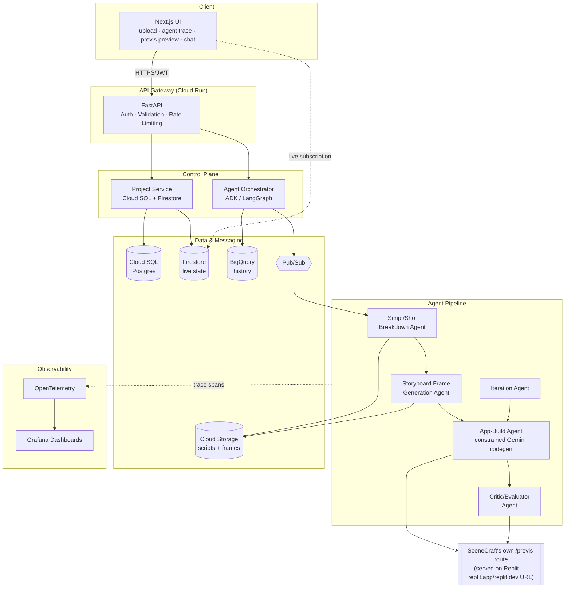
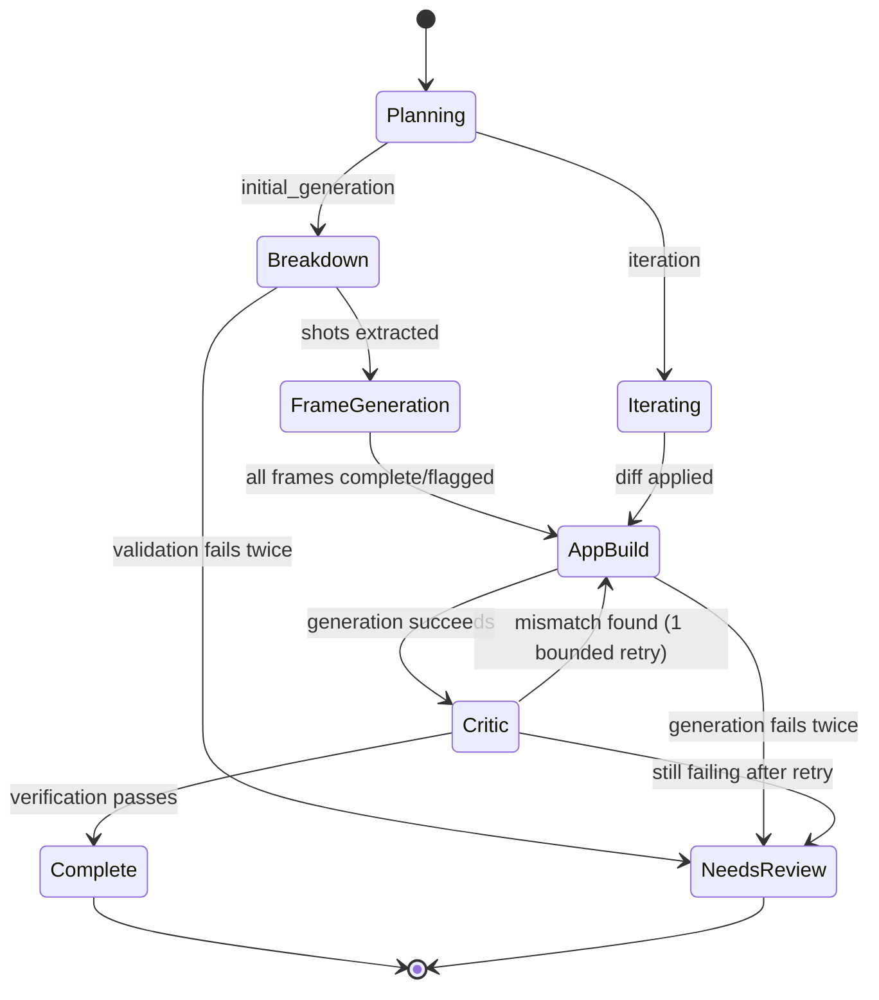
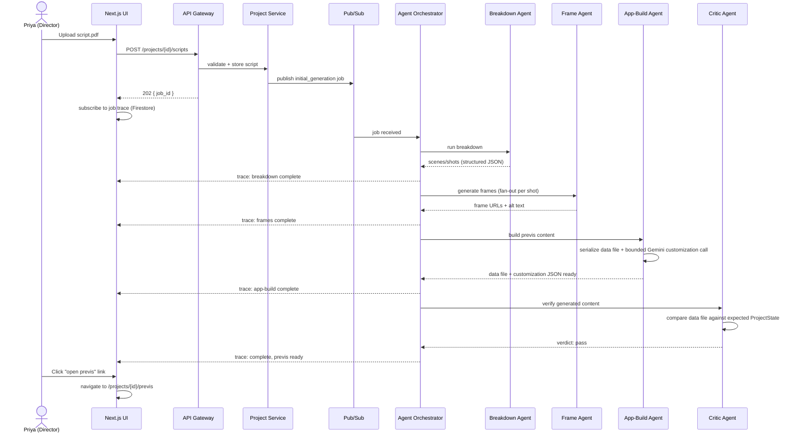
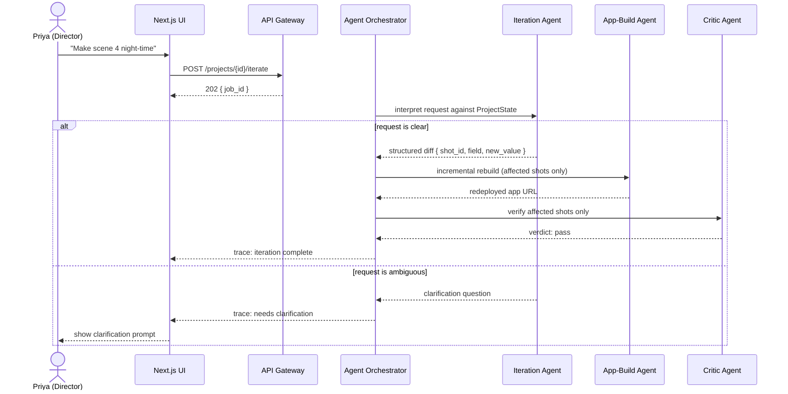
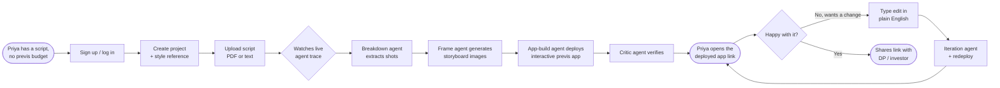
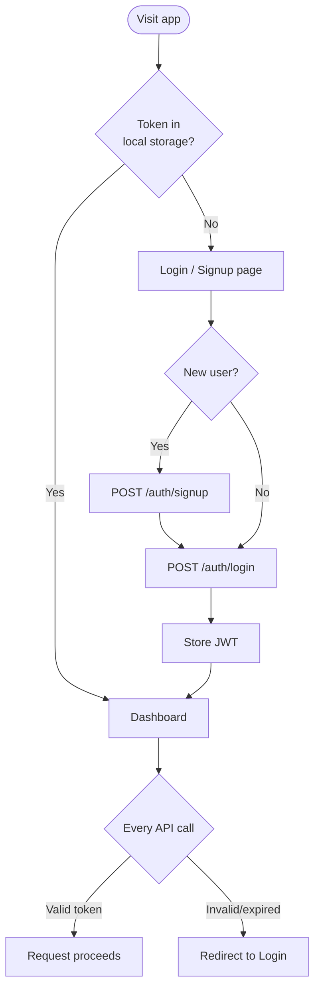
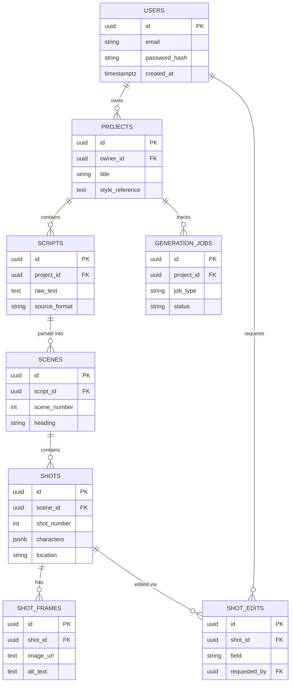
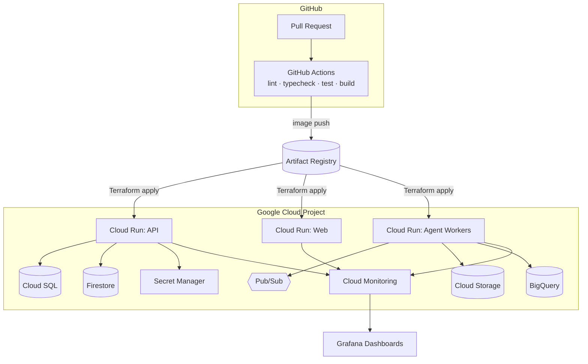
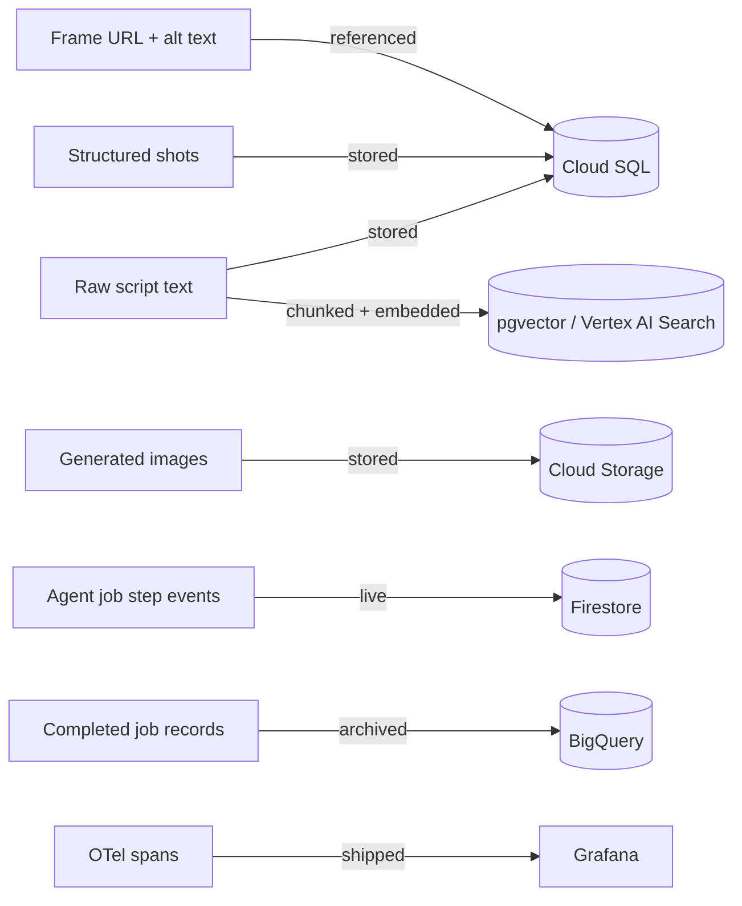

# SceneCraft — Architecture & User Flow Diagrams

> Read `00-INDEX.md` first. All diagrams here use Mermaid syntax — they render natively on GitHub, in most editors, and in Claude Code's preview. If your viewer doesn't render Mermaid, the ASCII fallback for the core architecture is in `03-SYSTEM-DESIGN.md`.

---

## 1. System Architecture

---

## 2. Agent Orchestration Graph (state machine)

---

## 3. Sequence Diagram — Initial Generation (script upload → live previs)

---

## 4. Sequence Diagram — Natural-Language Iteration

---

## 5. User Flow — Priya's End-to-End Journey (primary persona)

---

## 6. User Flow — Auth

---

## 7. Entity Relationship Diagram

---

## 8. Deployment / Infrastructure Diagram

---

## 9. Data Flow — Where Each Artifact Lives

---

## Notes for Claude Code

- These diagrams are the **contract**, not decoration — if an implementation detail in a later phase contradicts one of these flows (e.g. the Critic Agent calling App-Build directly instead of going back through the Orchestrator), that's a signal to stop and reconcile the diagram and the code, not to silently drift from the design.
- The state diagram in section 2 maps directly to the `generation_jobs.status` enum in `05-DATABASE-DESIGN.md` — keep them in sync if either changes.
- The two sequence diagrams (sections 3 and 4) are the two flows every end-to-end test in `08-IMPLEMENTATION-PLAN.md` should exercise.
