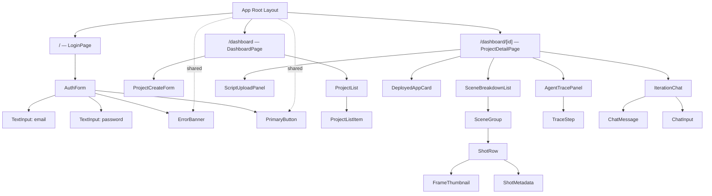
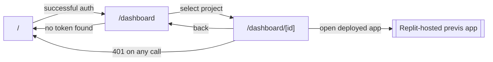

# SceneCraft — UI/UX Wireframes & Component Hierarchy

> Read `00-INDEX.md` first. Pairs with `02-TECH-STACK.md` (frontend stack), `06-API-DESIGN.md` (what data each screen consumes), and `10-DIAGRAMS.md` §5–6 (user flows these screens implement). Hand this file to Claude Code alongside `PHASE-01-FOUNDATIONS.md` and `PHASE-05-ITERATION-AND-TRACE-UI.md` when building the corresponding screens.

## 1. Design System

**Direction:** a restrained production-console aesthetic — this is a working tool for a film crew, not a marketing site. Dark, high-contrast, quiet accents. Avoid generic SaaS-template defaults (no cream backgrounds, no default indigo-on-white).

**Color tokens** (already established in the Phase 1 build):
| Token | Hex | Use |
|---|---|---|
| `charcoal` | `#1b1d21` | Primary background |
| `charcoal2` | `#25282e` | Card/panel background |
| `chalk` | `#efece5` | Primary text |
| `signal` | `#e8a33d` | Accent — primary actions, active states, alerts |
| `wire` | `#3a3f47` | Borders, dividers, inactive states |

**Typography:** a display sans (`Space Grotesk` or similar) for headings and UI chrome, a monospace face (`IBM Plex Mono` or similar) for labels, metadata, and the agent-trace log — the monospace choice deliberately evokes a shot log/terminal, reinforcing the "production tool" framing rather than a generic dashboard.

**Signature element:** a diagonal-stripe "slate mark" (`.slate-stripe` — see the Phase 1 CSS), used once per screen as a section divider, never repeated decoratively. It's a quiet nod to a clapperboard's identifying stripe without being literal/skeuomorphic.

**Spacing/radius:** generous whitespace, `rounded-md` (6px) on interactive elements, `rounded-lg` (8px) on cards/panels — consistent throughout, no per-component ad hoc values.

## 2. Screen Inventory

| Screen | Route | Built in |
|---|---|---|
| Login / Signup | `/` | Phase 1 |
| Dashboard (project list + create) | `/dashboard` | Phase 1 |
| Project detail (breakdown, frames, deploy status) | `/dashboard/[projectId]` | Phases 2–4 |
| Agent trace panel (live) | embedded in project detail | Phase 5 |
| Iteration chat | embedded in project detail | Phase 5 |
| Deployed previs app (Replit-hosted, separate codebase) | external URL | Phase 4 |

---

## 3. Wireframes

### 3.1 Login / Signup (`/`)

```
┌──────────────────────────────────────────┐
│                                            │
│   TAKE ONE                                │
│   SceneCraft                              │
│   Script in. Working previs app out.      │
│                                            │
│   ▨▨▨▨  (slate-stripe divider)            │
│                                            │
│   EMAIL                                   │
│   ┌────────────────────────────────────┐  │
│   │ you@studio.com                     │  │
│   └────────────────────────────────────┘  │
│                                            │
│   PASSWORD                                │
│   ┌────────────────────────────────────┐  │
│   │ ••••••••••••                       │  │
│   └────────────────────────────────────┘  │
│                                            │
│   [ Log in ]  (signal button, full width) │
│                                            │
│   New here? Create an account             │
│                                            │
└──────────────────────────────────────────┘
```
**States:** default → submitting (button label "Working…", disabled) → error (inline banner below the form, signal-colored border, never a blocking modal) → success (redirect to `/dashboard`).

### 3.2 Dashboard (`/dashboard`)

```
┌────────────────────────────────────────────────────────┐
│  PRODUCTION BOARD                                        │
│  Your projects                                           │
│  ▨▨▨▨                                                     │
│                                                            │
│  NEW PROJECT                                              │
│  ┌───────────────┐ ┌────────────────────┐ ┌─────────┐    │
│  │ Project title │ │ Style ref (opt.)   │ │ Create  │    │
│  └───────────────┘ └────────────────────┘ └─────────┘    │
│                                                            │
│  PROJECTS                                                 │
│  ┌────────────────────────────────────────────────────┐  │
│  │ Midnight Ferry — neo-noir, high contrast        →   │  │
│  ├────────────────────────────────────────────────────┤  │
│  │ Coastal Static                                  →   │  │
│  └────────────────────────────────────────────────────┘  │
│                                                            │
└────────────────────────────────────────────────────────┘
```
**Empty state:** "No projects yet — create one above to get started." — never a bare blank area.
**Loading state:** skeleton rows matching the card height, not a spinner overlay (keeps layout stable).

### 3.3 Project Detail — Upload & Breakdown View (Phases 2–3)

```
┌────────────────────────────────────────────────────────┐
│  ← Back to projects                                      │
│  MIDNIGHT FERRY                                           │
│  neo-noir, high contrast                                  │
│  ▨▨▨▨                                                      │
│                                                            │
│  ┌─ Upload ──────────────────┐  ┌─ Agent trace ────────┐ │
│  │ [Choose file]  [Upload]   │  │ ● breakdown  complete │ │
│  │                            │  │ ● frames     12/18    │ │
│  └────────────────────────────┘  │ ○ app_build  queued   │ │
│                                    │ ○ critic     queued   │ │
│  SCENES                            └───────────────────────┘ │
│  ┌────────────────────────────────────────────────────┐  │
│  │ ▸ INT. FERRY - NIGHT                                │  │
│  │    Shot 1  [frame img]  Dana stares at the water    │  │
│  │    Shot 2  [frame img]  Wide, ferry approaches dock │  │
│  │ ▸ EXT. DOCK - NIGHT                                 │  │
│  └────────────────────────────────────────────────────┘  │
└────────────────────────────────────────────────────────┘
```
**Per-shot states:** frame generating (skeleton placeholder in the image slot), frame failed (placeholder image + a small "flagged" badge, per `PHASE-03-FRAME-GENERATION.md` §5 — never a broken-image icon).

### 3.4 Project Detail — Deployed App & Iteration (Phases 4–5)

```
┌────────────────────────────────────────────────────────┐
│  MIDNIGHT FERRY                                           │
│  ▨▨▨▨                                                      │
│                                                            │
│  ┌─ Live previs app ──────────────────────────────────┐  │
│  │  🔗 scenecraft-midnight-ferry.replit.app      [Open]│  │
│  │  Last verified: just now ✓                          │  │
│  └────────────────────────────────────────────────────┘  │
│                                                            │
│  ┌─ Agent trace ─────────────┐  ┌─ Iterate ─────────────┐ │
│  │ ● iteration   complete    │  │ "Make scene 4         │ │
│  │ ● app_build   complete    │  │  night-time"           │ │
│  │ ● critic      complete    │  │                        │ │
│  └────────────────────────────┘  │ [Type a change...]  ➤ │ │
│                                    └────────────────────────┘ │
└────────────────────────────────────────────────────────┘
```
**Clarification-needed state:** the agent's question appears as a chat-style bubble from SceneCraft in the Iterate panel, with the input re-focused — never a dead-end error.
**Failed/needs-review state:** the trace panel's failing step shows in a muted red-orange (not the primary `signal` amber, to keep alert states visually distinct from normal accent usage), with the `error_detail` text visible, plus a "Retry" action.

---

## 4. Component Hierarchy



**Shared/primitive components** (build once, reuse everywhere — this is the shadcn/ui layer from `02-TECH-STACK.md`): `PrimaryButton`, `TextInput`, `ErrorBanner`, `Badge` (used for status indicators — `complete`/`running`/`failed`/`needs_review`), `Skeleton` (loading placeholders), `EmptyState`.

**Data-fetching boundary:** `ProjectDetailPage` is the only component that subscribes to the live Firestore trace (per `PHASE-05-ITERATION-AND-TRACE-UI.md` §7) — it passes trace data down to `AgentTracePanel` as props. Don't let `AgentTracePanel` open its own subscription; keeping the live-data boundary at the page level makes the component testable with static props.

## 5. Navigation Map



No nested modals-within-modals anywhere in this app — every state above is a real route or a panel within the current page, never a modal stack. This keeps the browser back button behaving predictably, which matters more than it sounds like for a tool judges will be clicking through live.

## 6. States Checklist (apply to every data-bearing component)

Every component that renders server data must explicitly handle, and be tested against, all four of:
- [ ] **Loading** — skeleton matching final layout dimensions, never a layout-shifting spinner
- [ ] **Empty** — a specific, helpful message, never a blank area or a generic "No data"
- [ ] **Error** — the actual error message from the API's error envelope (`06-API-DESIGN.md`), not a generic "Something went wrong," with a retry action where one makes sense
- [ ] **Populated** — the normal case

## 7. Responsive Behavior

This is a desktop-first production tool (the primary use case is a director at a laptop during a production meeting), but must not break on tablet:
- Below `768px`: the two-column layouts in sections 3.3–3.4 (main content + trace panel) stack vertically, trace panel below main content.
- The agent-trace panel and iteration chat are the two components most likely to be referenced live during a demo — verify their mobile layout explicitly, don't leave it as an afterthought just because the primary use case is desktop.

## 8. Accessibility (ties to the NFR in `01-PRD.md` §13)

- Every interactive element reachable and operable via keyboard alone — verify by tabbing through each wireframe above without a mouse.
- `FrameThumbnail` renders the agent-generated `alt_text` from `PHASE-03-FRAME-GENERATION.md`, not a generic "storyboard image" placeholder.
- Status badges (`complete`/`failed`/etc.) convey state through text and shape, not color alone, for colorblind-safe status recognition.
- Focus rings use the `.focus-ring` utility (signal-amber outline) consistently — never suppressed with `outline: none` anywhere in the codebase.
